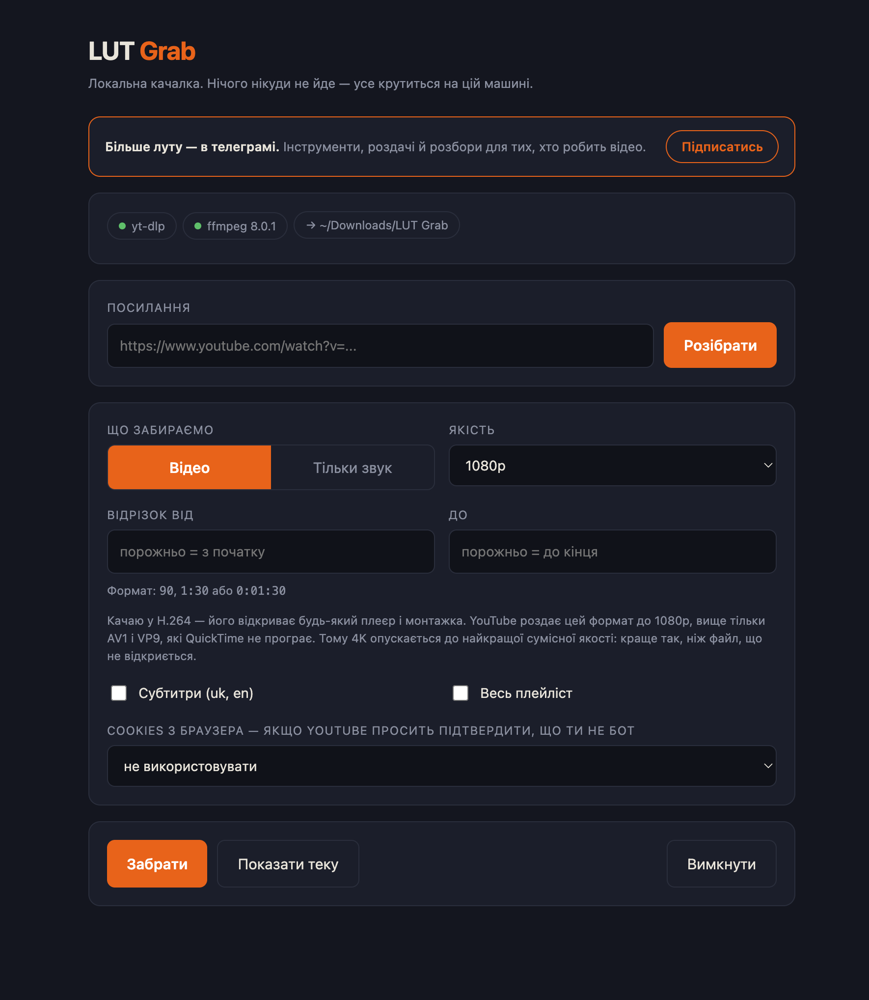

# LUT Grab

Локальна качалка відео для macOS. Забирає відео, звук або обкладинку на диск
з YouTube, TikTok, Instagram і ще приблизно 1750 сайтів.

Працює на твоїй машині: піднімає сервер на `127.0.0.1`, показує вікно і передає
посилання в [yt-dlp](https://github.com/yt-dlp/yt-dlp). Твої посилання нікуди
не йдуть, акаунт не потрібен, історію завантажень ніхто не збирає.



## Завантажити

Готовий DMG лежить у [Releases](../../releases). Всередині свій Python,
тому ставити нічого не треба.

**Перший запуск.** Програма не підписана в Apple, тому macOS скаже, що не змогла
перевірити її на шкідливість. Не тисни «Перемістити в кошик»: тисни «Скасувати»,
далі Системні налаштування → Приватність і безпека → «Все одно відкрити».
Або одним рядком у терміналі:

```bash
xattr -dr com.apple.quarantine "/Applications/LUT Grab.app"
```

## Що вміє

| Що | Як це виглядає |
|---|---|
| Сайти | YouTube, TikTok, Instagram, Facebook, X, Twitch, Vimeo, Reddit, SoundCloud і ще ~1750 |
| Якість | від 144p до 1080p у H.264, який відкриває будь-який плеєр і монтажка |
| Відрізок | вписуєш `1:20` і `3:40`, отримуєш рівно ці 140 секунд, різ по кадру |
| Тільки звук | mp3 з обкладинкою і назвою треку |
| Превью | обкладинка ролика окремим jpg |
| Субтитри | українські та англійські, окремим файлом |
| Плейліст | галочка, і качається весь |

Файли лягають у `~/Downloads/LUT Grab/`. Перший запуск попросить натиснути дві
кнопки: вони докачають `yt-dlp` і `ffmpeg` у `~/Library/Application Support/lut-grab/`.

## Чому немає 4K

YouTube роздає 1440p і вище тільки в AV1 і VP9, а їх не відкриває ні QuickTime,
ні Фото, ні Final Cut. Тому качається H.264, і запит на 4K тихо опускається до
найкращої сумісної якості. Краще так, ніж файл, який не відкриється.

## Зібрати самому

Потрібен Python 3.9+ і `ffmpeg` у системі (або кнопка в самій програмі).

```bash
python3 server.py                    # запуск без збірки
python3 -m venv .venv && .venv/bin/pip install pyinstaller pywebview
./build-app.sh                       # dist/LUT Grab.app і dist/LUT Grab.dmg
```

`pywebview` опційний: без нього інтерфейс відкриється у браузері замість
власного вікна. Windows-версія збирається на GitHub Actions, бо PyInstaller
не вміє крос-компіляцію.

## Ліцензія

MIT. Уся важка робота тут робиться yt-dlp і ffmpeg, у кожного своя ліцензія.

---

Зроблено для [ЛУТ](https://t.me/lootaimo) - AI і вайбкодинг для ютуберів.
